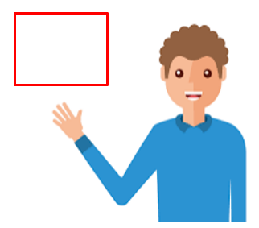
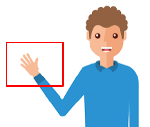
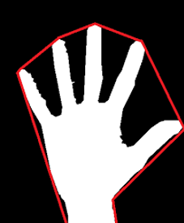
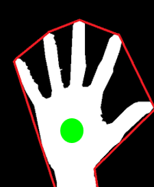
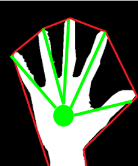
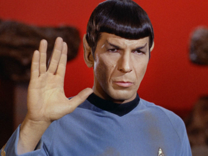

# Finger Count with OpenCV

**Description:**  
This project is a real-time hand finger counting application. It utilizes OpenCV for image processing and scikit-learn for mathematical computations, such as Euclidean distance, to detect and count fingers in a specified region of interest (ROI).

## How It Works (Video)
To better understand the project, you can watch this [video demonstration](https://youtu.be/OmfFjwsqnpk) showcasing its functionality in real-time.

## Features
- Real-time hand detection and finger counting.
- Background subtraction using a weighted average.
- Convex hull and contour analysis for precise finger detection.
- Configurable ROI and parameters for customization.

## Installation
To use this project, follow these steps:

1. Clone this repository:
   ```bash
   git clone https://github.com/your-username/finger-count.git
   ```
2. Navigate to the project folder:
   ```bash
   cd finger-count
   ```
3. Create and activate a virtual environment (optional but recommended):
   ```bash
   python -m venv .venv
   source .venv/bin/activate # On Windows: .venv\Scripts\activate
   ```
4. Install the required dependencies:
   ```bash
   pip install -r requirements.txt
   ```

## Usage
1. Ensure your computer has a functional webcam.
2. Run the notebook or script to start the application:
   ```bash
   python finger_count.py
   ```
3. Position your hand within the defined ROI (default is the top-right corner of the screen) and observe the detected fingers.

### ROI Adjustment
If needed, you can adjust the region of interest (ROI) by modifying the `roi_top`, `roi_bottom`, `roi_right`, and `roi_left` variables in the code.

## Strategy for Counting Fingers
This project follows a structured strategy to count fingers:

1. **Define ROI and Background Average:**  
   - Select a region of interest (ROI) in the video frame.
   - Calculate the average background value for the first 60 frames to distinguish the hand from the background.


2. **Detecting the Hand Using Thresholding:** 
- When a hand enters the ROI, the program applies thresholding to extract the hand segment for further processing.
-    
  

3. **Convex Hull and Contour Analysis:**   
- The convex hull technique is used to outline the hand's shape.
- External contours of the hand are analyzed to identify extreme points (top, bottom, left, right).
- Then using some math, we’ll calculate the center of the hand
-   


4. **Finger Counting Algorithm:**  
- The distance from the center of the hand to the outermost points is calculated.
- A circular ROI is created, and any points outside the circle and above the wrist are counted as fingers.
-  


## Known Limitations

### Error in Finger Counting (Example)  
- In some cases, the algorithm may not accurately count the fingers. This can happen due to:  
  1. Rapid movement of the hand.  
  2. Overlapping fingers causing contour misdetection.
  3. Lighting conditions affecting thresholding.
  4.   
     
### Watch an Example
[Watch this video](https://youtu.be/QAjIrCWKxMY)  

## Contact
If you have any questions, feel free to contact me:  
- **Email:** furkanmertee@gmail.com 
- **GitHub:** [furkanmerterciyes](https://github.com/furkanmerterciyes)

